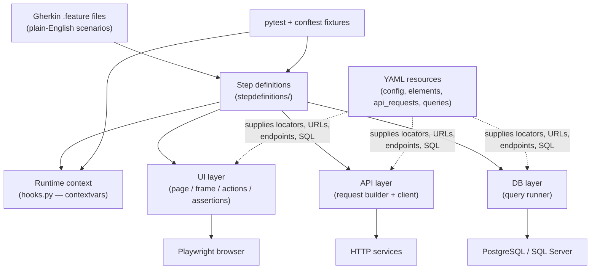

# PTAF — Playwright Test Automation Framework

PTAF is a single, unified test automation framework for testing **web UIs, REST APIs, and databases** from one codebase. You describe what to test in plain-English `.feature` files, and the framework turns those sentences into real browser clicks, HTTP calls, and SQL queries.

It is built in **Python** on top of **Playwright** and **pytest-bdd**, and it keeps everything that changes often URLs, element locators, API endpoints, SQL out of the code and inside readable **YAML** files. It also ships an optional **AI assistant** that can draft new feature files for you using Google Gemini.

If you have never seen this repo before, read the [Architecture](#architecture) section first — it explains the whole system in five minutes.

---

## Table of contents

- [What PTAF gives you](#what-ptaf-gives-you)
- [Technology stack](#technology-stack)
- [Architecture](#architecture)
- [How a test actually runs](#how-a-test-actually-runs)
- [Project structure](#project-structure)
- [Getting started](#getting-started)
- [Running tests](#running-tests)
- [Writing a test (end to end)](#writing-a-test-end-to-end)
- [Configuration](#configuration)
- [Reporting](#reporting)
- [The AI assistant](#the-ai-assistant)
- [Conventions worth knowing](#conventions-worth-knowing)

---

## What PTAF gives you

- **One framework, three test types.** UI, API, and database tests share the same Gherkin language, the same runner, and the same reports.
- **Plain-English tests.** Scenarios are written in Gherkin, so non-developers can read (and often write) them.
- **No hard-coded test data.** Locators, endpoints, queries, URLs, and credentials live in YAML and environment variables never in the test logic.
- **Cross-browser.** Runs on Chromium, Firefox, or WebKit through Playwright.
- **Parallel execution.** Scenarios can run concurrently to keep suites fast.
- **Rich HTML reports** with automatic screenshots captured the moment a test fails.
- **An AI helper** that drafts, validates, and quality-checks new feature files.

---

## Technology stack

| Concern | Technology |
|---|---|
| Language | Python 3.11+ |
| Dependency / environment manager | [uv](https://docs.astral.sh/uv/) |
| Browser automation | [Playwright](https://playwright.dev/python/) (synchronous API) |
| BDD / test runner | [pytest](https://docs.pytest.org/) + [pytest-bdd](https://pytest-bdd.readthedocs.io/) |
| Parallelism | pytest-xdist |
| Reporting | pytest-html (self-contained, with failure screenshots) |
| Configuration | YAML (PyYAML) |
| Database access | psycopg (PostgreSQL), pyodbc (SQL Server) |
| API calls | Playwright `APIRequestContext` |
| Secrets | environment variables via python-dotenv (`.env`) |
| AI assistant | Google Gemini, exposed through a `ptaf-ai` CLI (Click) |

---

## Architecture

PTAF is layered. The top layer is human readable; each layer below it gets closer to the actual browser, network, or database. Everything in the middle is glue that turns a sentence into an action.



**The layers, top to bottom:**

1. **Feature files (`src/test/resources/features/`)** — the tests themselves, written in Gherkin (`Given / When / Then`). This is the only layer most test authors touch.
2. **Step definitions (`src/test/stepdefinitions/`)** — Python functions that each match one Gherkin sentence. They are thin: they read parameters from the sentence and call into the layers below.
3. **Runtime context (`src/main/ptaf/hooks.py`)** — a small module holding the "current" Playwright instance, browser, page, and scenario using `contextvars`. It lets any step reach the live browser without passing objects around everywhere.
4. **Domain layers (`src/main/ptaf/`):**
   - **UI** (`ui/`) — page and iframe interaction, an action performer, an assertion performer, and locator helpers that translate YAML locator strings into Playwright selectors.
   - **API** (`api/`) — builds requests from `api_requests.yml`, resolves the base URL/auth from config, and sends them via Playwright's request context.
   - **DB** (`db/`) — opens connections (PostgreSQL/SQL Server) and runs named queries from `db_queries.yml`.
5. **Resources (`src/test/resources/`)** — all the data the layers need. At startup these YAML files are merged into one lookup table, so a step can ask for `google_url` or `google_page.search_flt` by key.
6. **pytest + `conftest.py`** — the engine. Fixtures create and tear down the browser per scenario, register every feature file, and attach screenshots on failure.

---

## How a test actually runs

When you run `uv run pytest`, this is the sequence end to end:

1. **Discovery.** `scenario_bindings.py` finds every `.feature` file under `resources/features/` and registers each scenario with pytest-bdd, so each Gherkin scenario becomes a real pytest test.
2. **Session startup.** A single Playwright instance starts for the whole run and is shared by both UI and API tests (stored in `hooks`).
3. **Per-scenario setup.** For a UI scenario, fixtures launch the configured browser, open a fresh context and page, and publish them into the runtime context.
4. **Execution.** pytest-bdd matches each Gherkin line to a step definition. The step pulls the live `page` (or API/DB helper) and calls the matching domain layer, which resolves any YAML locator/endpoint/query and performs the real action.
5. **On failure.** A screenshot of the page is captured automatically and embedded into the HTML report.
6. **Cleanup.** After each scenario, API and DB resources are disposed and the browser is closed — unless the feature is tagged `@LastScenario`, in which case the browser is reused across the feature for speed.

---

## Project structure

The repo follows a `src/main` (framework) + `src/test` (tests & test data) layout.

```
PTAF/
├── src/
│   ├── main/
│   │   └── ptaf/                 # The framework (importable package)
│   │       ├── api/              # API request building & sending
│   │       ├── db/               # Database connections & query execution
│   │       ├── ui/               # Page/frame interaction, actions, assertions, locators
│   │       ├── utils/            # Config loader, browser factory, helpers
│   │       ├── ai/               # AI feature-generation assistant
│   │       └── hooks.py          # Runtime context (current browser/page/scenario)
│   └── test/
│       ├── stepdefinitions/      # Gherkin step definitions (Python)
│       ├── resources/
│       │   ├── features/         # .feature files (the tests)
│       │   ├── config/           # config.yml, AI config
│       │   ├── elements/         # UI locator maps
│       │   ├── api_requests/     # API endpoint definitions
│       │   └── queries/          # SQL query definitions
│       ├── unit/                 # Unit tests for the framework itself
│       └── runners/              # Notes on test execution (pytest, not runner classes)
├── conftest.py                   # Fixtures & hooks (browser lifecycle, screenshots)
├── pytest.ini                    # Markers, test paths, options
├── pyproject.toml                # Dependencies & packaging
└── ReadMe.md
```

---

## Getting started

**Prerequisites:** Python 3.11+, [uv](https://docs.astral.sh/uv/), and Node.js (for Playwright MCP).

```bash
# 1. Python dependencies
uv sync

# 2. Playwright browsers for pytest UI/API tests
uv run playwright install

# 3. Playwright MCP server + its browsers (for ptaf-ai explore-generate)
npm install
npm run mcp:install-browser

# 4. (Optional) Secrets — DB password, API tokens, GEMINI_API_KEY
cp .env.example .env
```

Secrets such as `DB_PASSWORD`, API auth tokens, and `GEMINI_API_KEY` are read from `.env` and **never** committed.

---

## Running tests

| Goal | Command |
|---|---|
| Run everything | `uv run pytest` |
| UI tests only | `uv run pytest -m ui` |
| API tests only | `uv run pytest -m api` |
| Database tests only | `uv run pytest -m db` |
| Regression suite | `uv run pytest -m regression` |
| Smoke suite | `uv run pytest -m smoke` |
| Run in parallel | `uv run pytest -n auto` |
| A single feature by name | `uv run pytest -k "google"` |

Gherkin tags map to pytest markers — drop the `@`. For example `@api` on a feature is selected with `uv run pytest -m api`.

---

## Writing a test (end to end)

A complete UI test is three small pieces. **None of them require touching framework code.**

**1. Describe the behaviour** — `src/test/resources/features/google.feature`:

```gherkin
@google
Feature: Google Validation

  Background: Navigate to Google
    Given we navigate to google_url url

  Scenario: Search for wooden spoon
    Given we enter value on page google_page locator search_flt value "wooden spoon"
    When we press on page google_page locator body key "Enter" keyboard
    Then we capture screenshot on page google_page locator body name "google/result"
```

**2. Point the keys at real things**  values live in YAML, not in the sentence:

```yaml
# resources/config/config.yml
google_url: "https://www.google.com/"
```

```yaml
# resources/elements/google.yml
elements:
  google_page:
    body: "CSS_body"
    search_flt: "CSS_#APjFqb"
```

**3. Run it:**

```bash
uv run pytest -k "google"
```

The sentence `we enter value on page google_page locator search_flt value "wooden spoon"` is matched by an existing step definition, which looks up the `google_page.search_flt` locator in YAML and types into it with Playwright. API and database steps work the same way the request lives in `api_requests.yml` and the SQL lives in `db_queries.yml`.

---

## Configuration

| File | What it holds |
|---|---|
| `resources/config/config.yml` | Browser choice, headless mode, environment URLs, database connection, API services |
| `resources/elements/*.yml` | UI locator maps, grouped by logical "page" |
| `resources/api_requests/api_requests.yml` | Named API requests (method + endpoint, with `{placeholders}`) |
| `resources/queries/db_queries.yml` | Named SQL query templates |
| `resources/config/ai_assistant.yml` | Settings for the AI assistant |
| `.env` | Secrets — DB password, API tokens, `GEMINI_API_KEY` (never committed) |

All YAML under `resources/` is merged at startup into one keyed lookup, so any step can resolve a value by its dotted key (for example `database.connection_url` or `google_page.search_flt`).

---

## Reporting

Every run produces a self-contained HTML report at `reports/report.html`. When a UI test fails, a screenshot of the page at the moment of failure is embedded directly into the report, so you can see what the browser saw without rerunning anything.

```bash
uv run pytest -m smoke --html=reports/report.html
```

---

## The AI assistant

PTAF includes an optional assistant (the `ptaf-ai` command) that uses Google Gemini to help author tests. It generates Gherkin from a requirement, validates it against the framework's existing steps and YAML keys, runs quality gates (syntax + duplicate detection), and can triage failure logs.

```bash
uv run ptaf-ai generate --requirement "verify the Google search box is visible"
uv run ptaf-ai serve --port 8787      # local web UI + HTTP API
uv run ptaf-ai quality --project-root .   # syntax & duplicate quality gate
uv run ptaf-ai triage --log run.log       # explain a failure log
uv run ptaf-ai telemetry-report           # summarize generation activity
```

Set `GEMINI_API_KEY` in `.env` and tune behaviour in `resources/config/ai_assistant.yml`.

---

## Conventions worth knowing

- **Keyword-agnostic steps.** Step definitions use pytest-bdd's `keyword_step` decorator, so `Given`, `When`, `Then`, and `And` are interchangeable for the same step text — write whatever reads naturally.
- **Locator prefixes.** Locator strings in `elements/*.yml` carry a prefix (for example `CSS_...`) that tells the UI layer how to interpret the selector.
- **`@LastScenario`.** Tag a feature with this to reuse one browser across all its scenarios instead of relaunching per scenario — faster for long, sequential flows.
- **Database tests self-skip.** If no database is configured (`DB_PASSWORD` unset / server unreachable), `@db` scenarios are skipped rather than failed.
- **Tags become markers.** Any Gherkin `@tag` can be selected on the command line with `-m tag`.
```
